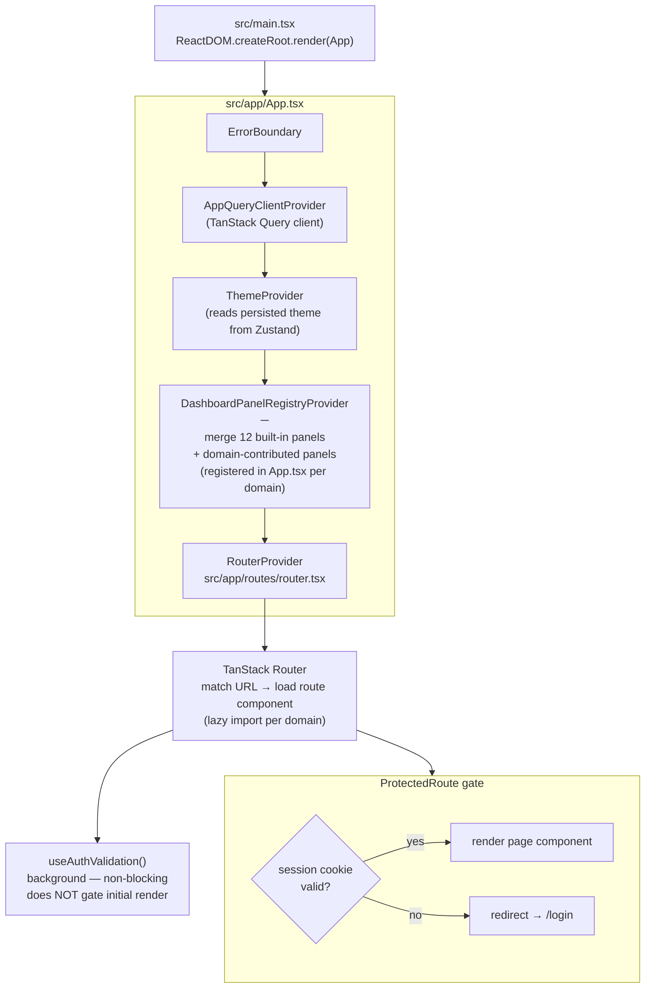
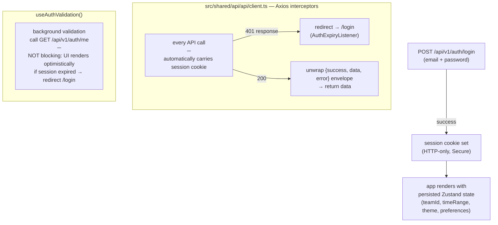
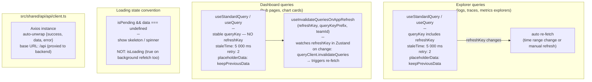
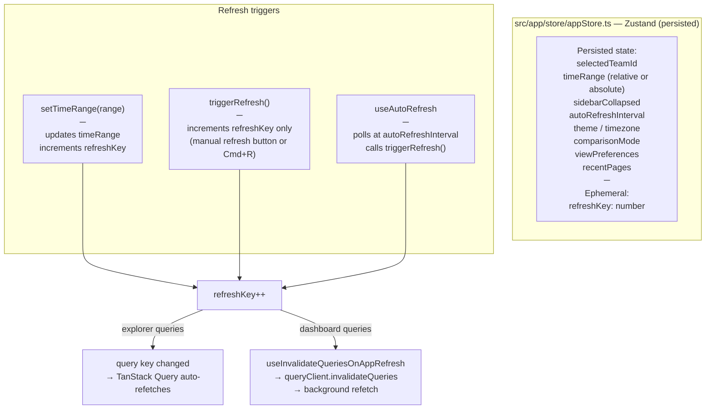
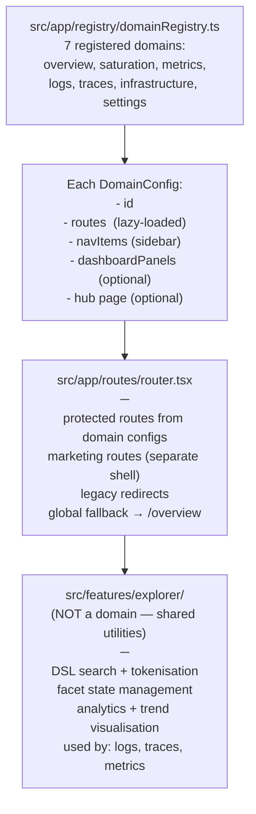
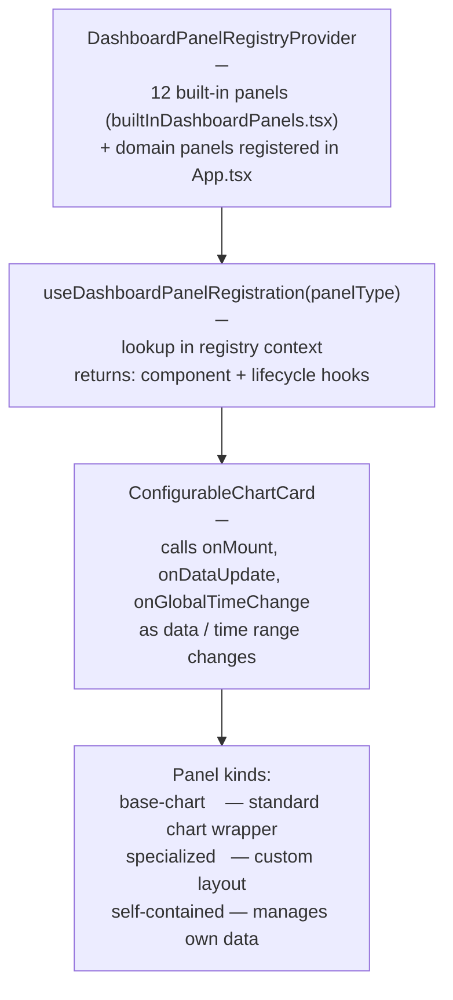

# Frontend Data Flow

Covers initial load, authentication, data fetching, refresh, and the dashboard vs. explorer query distinction.

---

## Application bootstrap

---

## Auth flow (web UI)

---

## Data fetching patterns

---

## Global store and refresh cycle

---

## Domain registry and routing

---

## Dashboard panel system

---

## URL state synchronisation

Explorers and hub tabs keep their state in the URL so links are shareable:

| Hook | What it syncs |
|------|--------------|
| `useTimeRangeURL()` | `startMs`, `endMs` or relative range |
| `useURLFilters()` | filter/query DSL string |
| `useUrlSyncedTab()` | active tab name |
| `useSearchParamsCompat()` | generic search param read/write |

Navigation to dynamic paths uses `dynamicNavigateOptions(to, search?)` and `dynamicTo(path)` from `src/shared/utils/navigation.ts` — these replace `as any` casts for TanStack Router branded path types.
